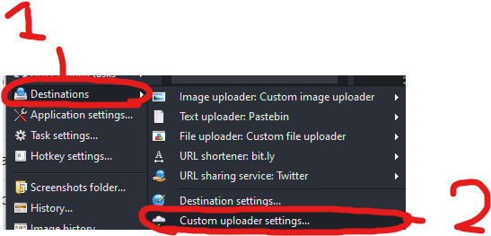
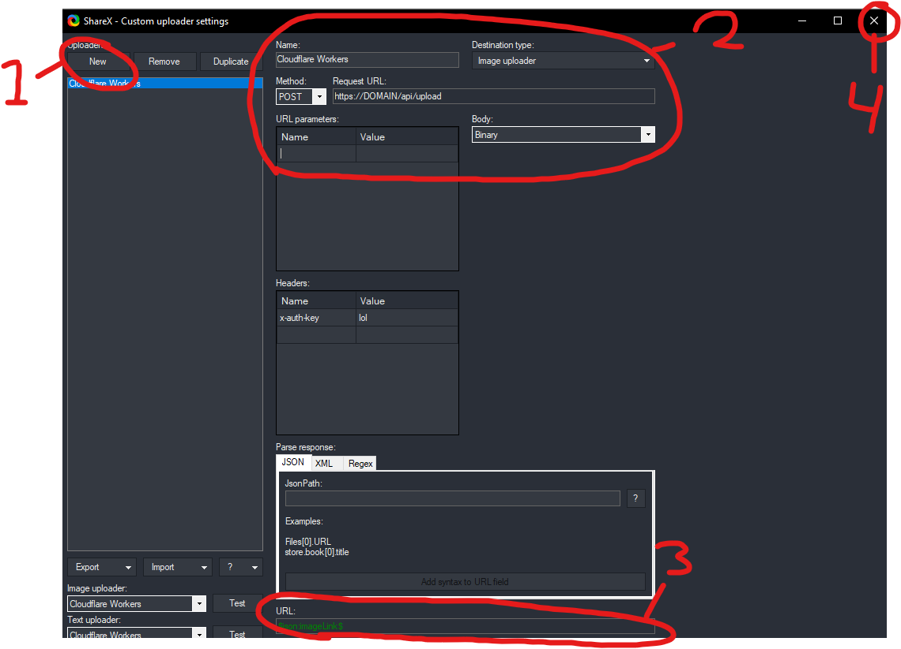
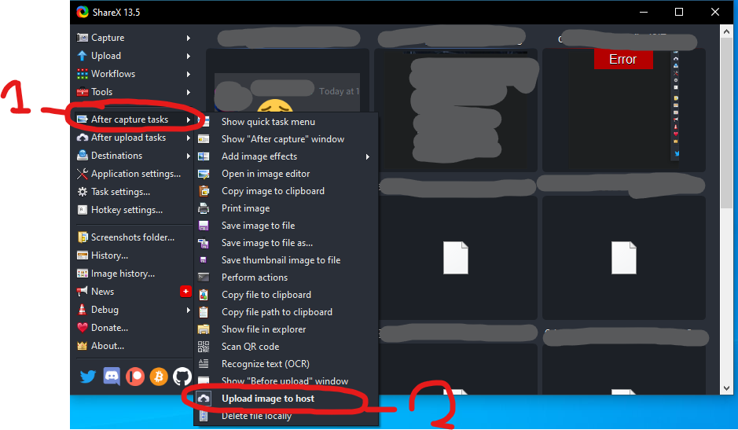
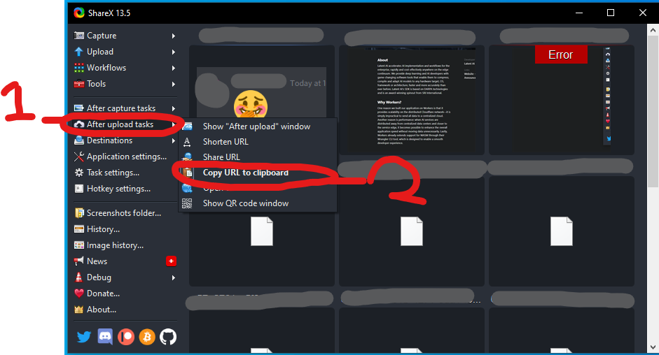

ShareX Cloudflare Workers
===============
A small (and very simple) project for uploading images to your own custom server backend using ShareX and Cloudflare
Workers.

----

## Setting up

#### Prerequisites

* You need [NodeJS](https://nodejs.org/) installed on your machine
* You need to have set up [Wrangler](https://github.com/cloudflare/wrangler) on your machine
    * You also need to be logged in!
* You need to set up a [KV Namespace](https://developers.cloudflare.com/workers/runtime-apis/kv) and note down the ID
    * Fill the ID inside the  `wrangler.toml` file later on!
* You need to have fun!

----

#### Setting up the server

First of all, update the file `wrangler.toml` and fill in the appropriate
`account_id`, `zone_id`, `kv_namespaces` and `route` fields (also anything else you'd like to customize).

Then, go to the `src/config.ts` file and fill out the variables in there.

Once you're done with that, ensure you're logged in with wrangler and it's simply typing `npm run deploy`, and it builds
the project, and uses `wrangler publish` command for you automatically!

---

### Setting up ShareX

#### Change destination settings

First of all, open ShareX and then find "Destinations"(1) and go to the "Custom uploader settings"(2) tab

----

Then, we need to fill out the information that ShareX needs in order to upload the image properly to our server.

1) Create a new custom uploader
2) Fill in the name, destination type, method and request URL as seen on the picture below
3) Our server returns the imageLink in the JSON response body as `{success: true, imageLink: """}`
   so we make sure ShareX fetches that image link
4) Exit, ShareX has saved these variables now!

----

----

#### Updating ShareX to upload to our server

----

### Finished!

Now everything should be working, if not, well crap.

... I'm kidding, feel free to open an issue, and I'll try to help!
